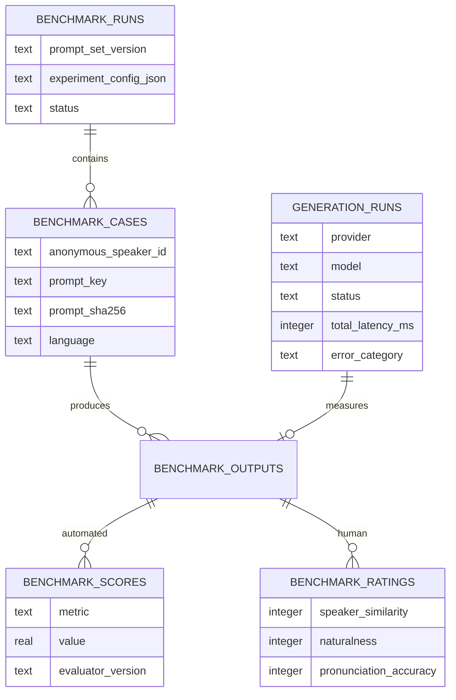

# Voice-model benchmarking

## Goal

The benchmark answers one product question: which model preserves a consented speaker's identity most convincingly while remaining natural and intelligible? Cost and latency are secondary constraints, not substitutes for voice fidelity.

The first controlled comparison uses two voice models, three to five speakers, the versioned English prompts in `benchmarks/prompts/v1.json`, identical source recordings, and identical delivery settings. Outputs are paired by speaker and prompt so model differences are not confounded by different input material.

## Small, efficient experiment

The minimum useful run is three speakers × six prompts × two models = 36 generated clips. Five speakers produces 60 clips and a stronger portfolio result. Start with English because it isolates model quality from translation and cross-language voice-localization effects. After selecting the better configuration, repeat a smaller multilingual slice with two prompts per language and native-language reviewers.

For every output, collect:

1. **Speaker similarity:** cosine similarity between the source and generated speaker embeddings. SpeechBrain's ECAPA-TDNN model provides embeddings and performs verification with cosine distance. Treat this as a supporting signal rather than identity ground truth, especially across languages.
2. **Intelligibility:** word error rate from a pinned Whisper model against the exact prompt. Use character error rate for languages where word segmentation is not stable. Whisper's own model card documents uneven accuracy across languages and accents, so report results by language rather than combining them blindly.
3. **Predicted naturalness:** UTMOS predicted mean-opinion score. This is a scalable model estimate, not a replacement for listener ratings.
4. **Human ratings:** blind 1–5 ratings for speaker similarity, naturalness, and pronunciation accuracy. Randomize model order and hide provider/model names. Use at least three ratings per output; when practical, include the source speaker as one reviewer for identity similarity.
5. **Operational metrics:** end-to-end and stage latency, output bytes, failure rate, provider, model version, and target language. WithYou captures these automatically in `generation_runs` without storing the requested message in analytics.

Primary implementation references:

- [SpeechBrain ECAPA-TDNN speaker-verification model](https://huggingface.co/speechbrain/spkrec-ecapa-voxceleb)
- [OpenAI Whisper model card](https://github.com/openai/whisper/blob/main/model-card.md)
- [UTMOS paper](https://arxiv.org/abs/2204.02152)
- [Microsoft DNSMOS implementation](https://github.com/microsoft/DNS-Challenge/tree/master/DNSMOS) — useful later for source-recording noise diagnostics, but not the primary synthesized-speech naturalness metric

## Recording collection protocol

Collect two separate files from each participant in the same room, during the same session, with the same microphone placement. The enrollment recording is the only file sent to the cloning providers. The shorter held-out reference is reserved for similarity analysis and blind listening; never use it to build either clone.

Before recording:

1. Assign the next anonymous ID, such as `S01`; do not put the person's name in a filename or benchmark record.
2. Review `benchmarks/templates/participant-consent.md` and retain the completed record privately.
3. Confirm that the participant is at least 18 and understands that Cartesia and ElevenLabs will process the enrollment audio.
4. Create the two filenames `S01_enrollment.mp3` and `S01_reference.mp3`.
5. Record in a quiet, furnished room. Turn off music, fans, televisions, notifications, voice effects, automatic enhancement, and aggressive noise suppression.
6. Keep a phone or microphone six to ten inches from the speaker. Do not change devices, rooms, or microphone position between the two files.
7. Ask for a comfortable, everyday speaking style—not an announcer voice. If a mistake occurs, pause and repeat the full sentence.
8. Listen to both files before accepting them. Reject clipping, heavy echo, background speech, interruptions, or a recording that is difficult to hear.

Prefer MP3 at 192 kbps or higher for provider compatibility. A clean WAV is also acceptable, but capture quality matters more than the container. Do not transcode a poor recording merely to change its extension.

### Enrollment prompt

Record this prompt at a natural pace. Target 75–90 seconds.

> Today I am making a clear recording of my natural speaking voice. I will speak at a comfortable pace, with the same tone and energy that I use in an ordinary conversation. Some days call for patience and careful thought, while others bring excitement, laughter, and unexpected good news. If the weather changes tomorrow, I will bring a warm jacket, a blue umbrella, and two cups of coffee. Can you hear the difference when I ask a question? Now I will slow down, take a comfortable breath, and continue.
>
> I remember quiet mornings, familiar songs, and long conversations with people I care about. Small details often become meaningful memories: the sound of rain against a window, the smell of dinner cooking, or the feeling of coming home after a long trip. At seven thirty on October twelfth, we can meet near the garden and share three photographs, two letters, and one favorite story. I hope this recording captures the sound, rhythm, warmth, and character of my everyday voice. Thank you for listening carefully.

### Held-out reference prompt

Stop the first recording, create a new file, and record this prompt once. Target 20–30 seconds. This file must not be uploaded to either cloning provider.

> On quiet mornings, I like to pause and think about the people and places that matter to me. Even when plans change unexpectedly, a familiar voice can make the day feel calmer. What would you choose to remember from today?

Do not ask participants to say their full name, address, account information, or other identifying details. Keep the identity-to-ID mapping outside the repository.

### Private storage and documentation

From the repository root, create the Git-ignored collection area and copy the manifest template:

```bash
mkdir -p benchmarks/private/audio benchmarks/private/consent benchmarks/private/manifests
cp benchmarks/templates/collection-manifest.example.csv benchmarks/private/manifests/collection-manifest.csv
```

Place audio in `benchmarks/private/audio/`, completed consent records in `benchmarks/private/consent/`, and update the private manifest after every collection. The repository `.gitignore` excludes this directory and common audio formats under `benchmarks/`, but always run `git status --short` before committing.

Do not put names, email addresses, signatures, or contact information in the manifest. Store the ID-to-identity mapping separately in a private location. Back up the private collection using encrypted storage; Git is not its backup system.

## Consent and data handling

- Collect only recordings from adults who explicitly consent to voice cloning, model-provider processing, comparison, and deletion timing.
- Explain which external providers will receive the audio before upload.
- Do not commit participant audio, provider voice IDs, credentials, raw messages, or the identity mapping to Git.
- Store source and generated audio in the existing private R2 bucket and metadata in owner-scoped D1 records.
- Delete a participant's benchmark records and provider clones if consent is withdrawn.
- Do not publish raw clips without a separate, explicit publication release. Aggregate results are the default portfolio artifact.
- Record consent withdrawal in the private manifest before deleting the related local files, provider clones, R2 objects, and D1 benchmark rows.

## Experimental controls

Keep these constant across both models:

- exact source audio bytes;
- exact prompt text and its SHA-256 digest;
- language, pace, volume, and emotion/delivery setting;
- output container and sample rate where providers allow it;
- evaluation model and version;
- preprocessing and loudness normalization;
- reviewer instructions and randomized presentation order.

Store provider-specific options in `benchmark_runs.experiment_config_json`. The configuration is reproducibility metadata and must never include API keys. A benchmark output links its model identity to the corresponding production-style `generation_runs` telemetry record.

## Database design



`benchmark_scores` uses one row per metric and evaluator version so new metrics can be added without a schema migration. Human ratings remain separate because they have different provenance and aggregation rules. `generation_runs` deliberately stores counts, timings, model identity, status, and coarse error categories—but no transcript, raw error message, credential, or audio.

## Analysis and reporting

Report the median and interquartile range per model for similarity, naturalness, intelligibility, and latency. Also show paired per-speaker differences so one unusually easy voice cannot dominate the average. Include failure rate and sample count. Do not claim statistical significance from three to five speakers; describe the result as an initial controlled evaluation and publish the protocol, prompt version, evaluator versions, and limitations alongside the chart.

The next implementation step is a benchmark runner that writes the existing schema, generates both model outputs with idempotent case IDs, then runs pinned local evaluators and exports a de-identified CSV for charts.
