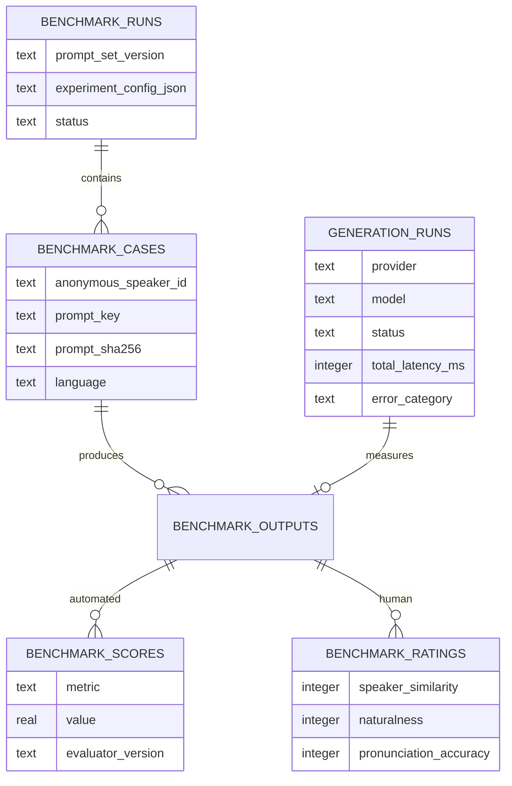

# Voice-model benchmarking

## Goal

The benchmark answers one product question: which model preserves a consented speaker's identity most convincingly while remaining natural and intelligible? Cost and latency are secondary constraints, not substitutes for voice fidelity.

The first controlled comparison uses two voice models, three to five speakers, the versioned English prompts in `benchmarks/prompts/v1.json`, identical source recordings, and identical delivery settings. Outputs are paired by speaker and prompt so model differences are not confounded by different input material.

## Small, efficient experiment

The minimum useful run is three speakers × six prompts × two models = 36 generated clips. Five speakers produces 60 clips and a stronger portfolio result. Start with English because it isolates model quality from translation and cross-language voice-localization effects. After selecting the better configuration, repeat a smaller multilingual slice with two prompts per language and native-language reviewers.

For every output, collect:

1. **Speaker similarity:** cosine similarity between the source and generated speaker embeddings. SpeechBrain's ECAPA-TDNN model provides embeddings and performs verification with cosine distance. Treat this as a supporting signal rather than identity ground truth, especially across languages.
2. **Intelligibility:** word error rate from a pinned Whisper model against the exact prompt. Use character error rate for languages where word segmentation is not stable. Whisper's own model card documents uneven accuracy across languages and accents, so report results by language rather than combining them blindly.
3. **Predicted naturalness:** UTMOS predicted mean-opinion score. This is a scalable model estimate, not a replacement for listener ratings.
4. **Human ratings:** blind 1–5 ratings for speaker similarity, naturalness, and pronunciation accuracy. Randomize model order and hide provider/model names. Use at least three ratings per output; when practical, include the source speaker as one reviewer for identity similarity.
5. **Operational metrics:** end-to-end and stage latency, output bytes, failure rate, provider, model version, and target language. WithYou captures these automatically in `generation_runs` without storing the requested message in analytics.

Primary implementation references:

- [SpeechBrain ECAPA-TDNN speaker-verification model](https://huggingface.co/speechbrain/spkrec-ecapa-voxceleb)
- [OpenAI Whisper model card](https://github.com/openai/whisper/blob/main/model-card.md)
- [UTMOS paper](https://arxiv.org/abs/2204.02152)
- [Microsoft DNSMOS implementation](https://github.com/microsoft/DNS-Challenge/tree/master/DNSMOS) — useful later for source-recording noise diagnostics, but not the primary synthesized-speech naturalness metric

## Recording collection prompt

Ask each participant to record the following once in a quiet room. A phone or laptop microphone is acceptable, but keep the device about six to ten inches away, turn off music and fans, and do not apply voice effects or noise suppression. Record WAV when available. Aim for a natural pace and roughly 45–60 seconds.

> Today I am making a clear recording of my natural speaking voice. Some moments call for patience, while others deserve energy and a bright sense of humor. If the weather changes tomorrow, I will bring a warm jacket, a blue umbrella, and two cups of coffee. Can you hear the difference when I ask a question? Now I will slow down for a moment, take a comfortable breath, and continue. I hope this message feels familiar, calm, and encouraging. Even a small memory can bring people closer, especially when it is shared with care. At seven thirty on October twelfth, we can meet near the quiet garden and tell our favorite stories. Thank you for listening to the sound, rhythm, and feeling of my voice.

Do not ask participants to say their full name, address, account information, or other identifying details. Assign IDs such as `S01` through `S05`; keep the identity-to-ID mapping outside the repository.

## Consent and data handling

- Collect only recordings from adults who explicitly consent to voice cloning, model-provider processing, comparison, and deletion timing.
- Explain which external providers will receive the audio before upload.
- Do not commit participant audio, provider voice IDs, credentials, raw messages, or the identity mapping to Git.
- Store source and generated audio in the existing private R2 bucket and metadata in owner-scoped D1 records.
- Delete a participant's benchmark records and provider clones if consent is withdrawn.
- Do not publish raw clips without a separate, explicit publication release. Aggregate results are the default portfolio artifact.

## Experimental controls

Keep these constant across both models:

- exact source audio bytes;
- exact prompt text and its SHA-256 digest;
- language, pace, volume, and emotion/delivery setting;
- output container and sample rate where providers allow it;
- evaluation model and version;
- preprocessing and loudness normalization;
- reviewer instructions and randomized presentation order.

Store provider-specific options in `benchmark_runs.experiment_config_json`. The configuration is reproducibility metadata and must never include API keys. A benchmark output links its model identity to the corresponding production-style `generation_runs` telemetry record.

## Database design

`benchmark_scores` uses one row per metric and evaluator version so new metrics can be added without a schema migration. Human ratings remain separate because they have different provenance and aggregation rules. `generation_runs` deliberately stores counts, timings, model identity, status, and coarse error categories—but no transcript, raw error message, credential, or audio.

## Analysis and reporting

Report the median and interquartile range per model for similarity, naturalness, intelligibility, and latency. Also show paired per-speaker differences so one unusually easy voice cannot dominate the average. Include failure rate and sample count. Do not claim statistical significance from three to five speakers; describe the result as an initial controlled evaluation and publish the protocol, prompt version, evaluator versions, and limitations alongside the chart.

The next implementation step is a benchmark runner that writes the existing schema, generates both model outputs with idempotent case IDs, then runs pinned local evaluators and exports a de-identified CSV for charts.
